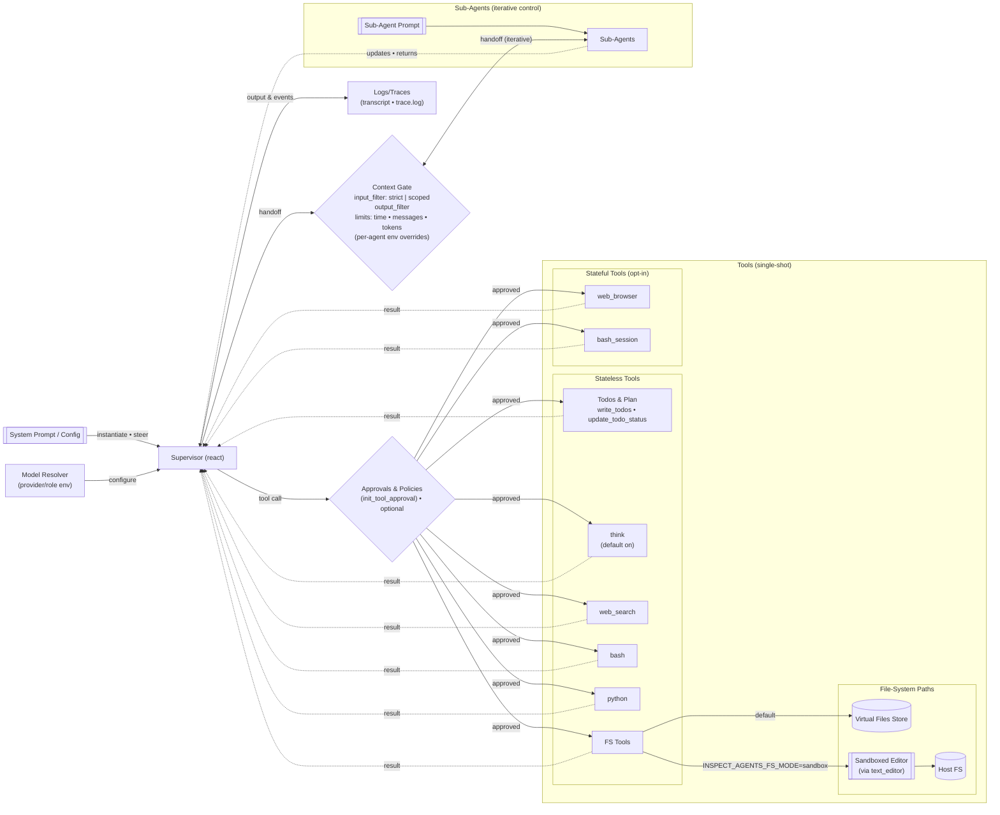

# Architecture (Detailed)

This expands on the high‑level picture in `README.md` with tool modes, state, and filesystem behavior.

If Mermaid isn’t rendered in your viewer, use the PNG fallback and source:
- PNG: `docs/diagrams/architecture.png`
- Source: `docs/diagrams/architecture.mmd`

## Notes
- Keep this as the single source for the detailed diagram. Link here from `README.md` to avoid duplication.
- If your docs site doesn’t render Mermaid, export a PNG/SVG from this source and store under `docs/diagrams/` alongside the `.mmd` source.
- The “Simple Architecture” is a conceptual scaffolding only. A runnable demo that composes public APIs (agent builders, approvals, tools) is available in `examples/demos/`.
