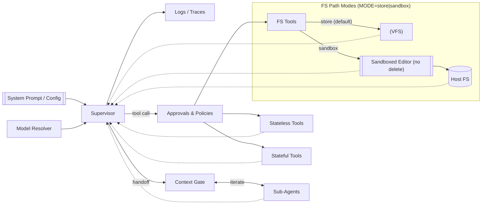

# Project Overview: inspect_agents

**inspect_agents** is a high-level agent orchestration library built on top of Inspect-AI that simplifies the development of practical LLM agents. It addresses the common pain points developers face when building agent systems by providing a complete framework with typed state management, safe tool execution, and rich observability out of the box.

## Core Purpose & Goals

The project's primary goal is to eliminate the overhead typically associated with setting up LLM agents by providing:

1. **Rapid Development**: Get a working agent running in seconds with minimal setup
2. **Production-Ready Defaults**: Safe-by-default configuration with optional risky tools gated behind environment flags
3. **Rich Observability**: Built-in logging, tracing, and structured transcripts for debugging and monitoring
4. **Flexible Architecture**: Support for both simple iterative agents and complex multi-agent supervision patterns

## Key Features & Architecture

### State Management
- **Typed State Models**: Pydantic-based `Todo` and `Files` models backed by Inspect-AI's Store for persistent, JSON-serializable state
- **Virtual Filesystem**: In-memory filesystem for safe file operations (default) with optional sandbox mode for real filesystem access
- **Cross-Agent State**: Shared todos and isolated per-agent file namespaces

### Agent Types
- **Supervisor Agents**: ReAct-style agents that can delegate to specialized sub-agents via handoff patterns
- **Iterative Agents**: Self-contained agents that work autonomously within time/step limits
- **Sub-Agent Orchestration**: YAML-configurable agent compositions with context gates and handoff boundaries

### Tool Ecosystem
- **Built-in Tools**: Todo management (`write_todos`) and filesystem operations (`ls`, `read_file`, `write_file`, `edit_file`)
- **Optional Standard Tools**: Web search, code execution (`bash`/`python`), web browser, and text editor - all gated behind environment flags
- **Safety-First Design**: Approval policies, quarantine filters, and sandbox confinement by default

### Security & Safety
- **Approval System**: Configurable approval policies (`dev`/`ci`/`prod`) with handoff exclusivity and tool parallelism controls
- **Filesystem Sandboxing**: Root path confinement, symlink denial, byte limits, and read-only modes
- **Environment-Gated Tools**: Potentially dangerous tools require explicit environment variable activation

## Use Cases & Target Audience

### Primary Use Cases
- Research agents that need to search, analyze, and synthesize information
- Code analysis and development assistance agents
- Task automation with file system interaction
- Multi-step workflows requiring persistent state and planning

### Target Developers
- Researchers building AI agent experiments
- Developers creating practical LLM-powered applications
- Teams needing production-ready agent infrastructure with observability
- Anyone wanting to prototype agent workflows quickly without boilerplate

## Technical Stack

- **Foundation**: Built on Inspect-AI for evaluation and orchestration primitives
- **State Persistence**: Inspect-AI Store with Pydantic models for type safety
- **Configuration**: YAML-based agent compositions with environment variable overrides
- **Testing**: Comprehensive pytest suite with CI/CD integration
- **Documentation**: MkDocs-powered documentation site with examples and guides

## Getting Started

The project emphasizes immediate usability with a self-contained quickstart that runs offline without external model providers:

```bash
export PYTHONPATH=src:external/inspect_ai
python examples/inspect/quickstart_toy.py
# Expected: Completion: DONE
```

This design philosophy of "working out of the box" extends throughout the project, making it accessible for both experimentation and production deployment.

## Architecture Overview



## Project Status

Currently in beta (v0.0.4) with active development focused on expanding tool capabilities, improving sub-agent patterns, and enhancing the developer experience. The project maintains high code quality standards with comprehensive testing, type checking, and documentation requirements.

### Coming Soon
- CI workflows (tests, lint, coverage) and release automation
- Expanded examples for web_browser and sandboxed exec
- Additional sub-agent templates (researcher, coder, editor)

## Repository Structure

- `src/inspect_agents/`: Core library implementation
- `tests/`: Comprehensive test suite with isolation patterns
- `examples/`: Runnable examples organized by use case
- `docs/`: Documentation site with guides and references
- `external/inspect_ai/`: Inspect-AI source for local development

## Contributing

The project follows conventional commits, type-safe development practices, and comprehensive testing requirements. See [CONTRIBUTING.md](../CONTRIBUTING.md) for detailed guidelines.

## License & Acknowledgments

- Licensed under [MIT](../LICENSE)
- Built on the Inspect-AI project and ecosystem
- Inspired by CLI-first developer experience from projects like Bun and Supabase
